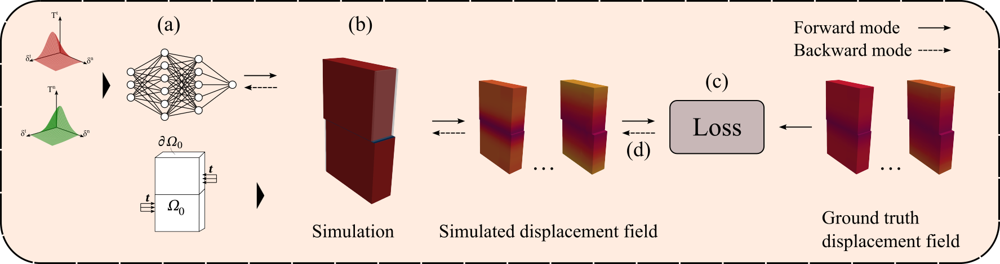

# DiscoveringCMZ

We introduce a learning algorithm to discover neural network parameterized cohesive laws using displacement fields. 

## Setup & Examples 
To run the examples, execute `python main.py --case ex1` for the first example and  `python main.py --case ex2` for the second.

## Dependencies

The following libraries are required: 

| Package               | Version (>=) |
|-----------------------|--------------|
| numpy                 | 1.25.2       |
| torch                 | 2.0.1        |
| nvidia-warp           | 1.6.0        |

## Citation
TODO